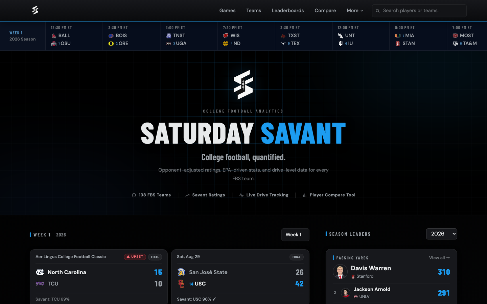
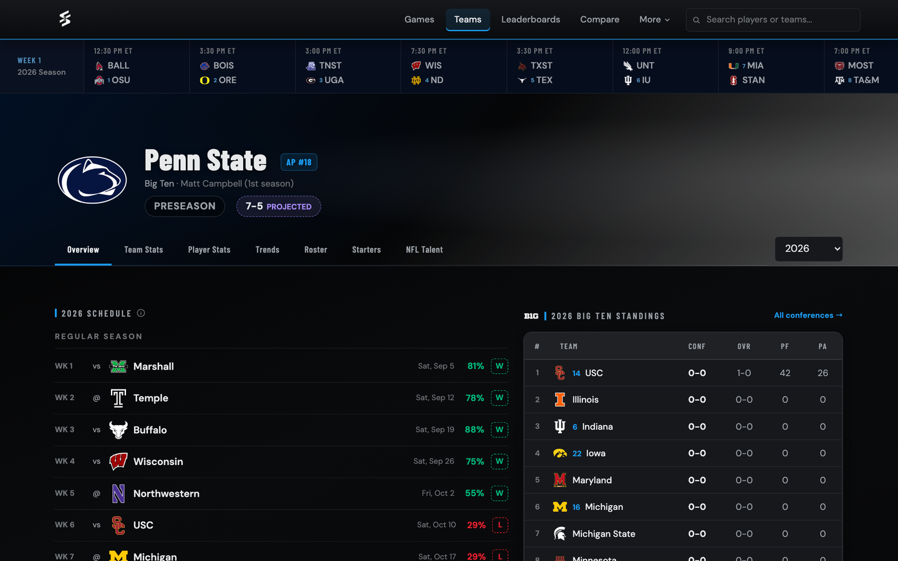

<div align="center">
  

  <h1>Saturday Savant</h1>

  <p><strong>College football, quantified.</strong><br>
  Opponent-adjusted ratings, a validated win-probability model, and drive-level data for every FBS team.</p>

  <p>
    <a href="https://saturdaysavant.com"><strong>saturdaysavant.com</strong></a>
  </p>

  <p>
    
    
    
    
  </p>

  
</div>

---

Saturday Savant is a Baseball-Savant-inspired analytics site covering every FBS team across the
2016–2025 seasons and the live 2026 one, bowls and the CFP bracket included. The differentiator is
depth and transparency rather than breadth: every proprietary metric here is built to be
explainable, and how it is computed — along with what it cannot do — is documented rather than
hidden behind a black box.

## The metrics

### Savant Rating

An opponent-adjusted Offensive, Defensive and Net Rating for every team, measured in **points per
10 drives** — football's possession is the drive, so scaling per-drive efficiency by 10 lands on a
familiar points-per-game scale while staying fully pace-neutral. Slow, grinding teams aren't
punished for having fewer possessions.

The decisions that matter are in what counts as a possession. FBS-vs-FBS only (an unratable
opponent can't be adjusted for). No overtime drives — they start at the 25 and break the scale. No
kneel-downs. **Garbage-time drives never enter the sample at all**, gated on score margin by
quarter, which is the football answer to the margin-of-victory problem: rather than capping blowout
scores after the fact, possessions where neither side is playing normal football are excluded up
front. Defensive and special-teams touchdowns fall out by construction, because a drive's points
are measured as the change in the *offense's* score during its own drive.

Opponent adjustment is iterative and KenPom-style, run to a fixed point rather than a single pass —
one pass corrects for opponents' raw strength, which is itself polluted by *their* schedules.
Recent games carry up to 1.35× the weight of the opener, and early-season samples are shrunk toward
the mean by a Bayesian prior instead of a hard games-played minimum. It measures how good a team is
**now**, not what it has accomplished.

→ [`pipeline/compute_savant_ratings.py`](pipeline/compute_savant_ratings.py) — the methodology is
documented in full at the top of the file.

### Savant Forecast

A logistic win-probability and expected-margin model for every FBS-vs-FBS game, trained locally and
served as a dot product (no sklearn in production).

| | walk-forward 2019–2025 | held-out 2025 |
|---|---|---|
| Accuracy | 71.1% | 71.8% (808 games) |
| Brier | 0.187 | 0.184 |

The part that keeps it honest is the **leakage contract**, stated at the top of
[`forecast_features.py`](forecast_features.py): only information knowable before kickoff goes in. An
Elo-style rating reflecting just the games already finished; prior-season Savant and SP+; preseason
roster signals (returning production, recruiting, net transfer stars); and game context. Explicitly
excluded are same-season aggregates, AP polls, and even a conference-game flag — the teams table
stores *current* conference only, so realignment would make historical membership silently wrong.

Predictions **freeze at kickoff**, so the public accuracy tracker is graded against exactly what was
on the page beforehand, never a retro-edited number. Each game carries a per-feature breakdown of
what drove that specific call. A separate 4-feature model handles FBS-vs-FCS games, where the FBS
side wins ~93% regardless and the model earns its keep on calibration and spread rather than
accuracy.

→ [`docs/FORECAST_RETRAIN.md`](docs/FORECAST_RETRAIN.md) — retrain protocol, ship bars, and a log of
rejected experiments (including the ones that *looked* like improvements).

### Also built here

**Returning Production** (how much of a team's output carries year to year) · **Key Transfers** ·
**Projected Record** (season win total derived from Forecast) · **NFL Talent** (every drafted or
signed player from a program) · percentile ranks against a player's own position group, curated to
show efficiency metrics rather than counting stats.

## The site



| | |
|---|---|
| **Home / Games** | Live score ticker, results and schedule by week, season leaders, upset tracking |
| **Team pages** | Overview, Team Stats (Savant Rating, SP+, percentiles, Returning Production), Player Stats, Trends, Roster, projected Starters, NFL Talent — any season 2016→present |
| **Player pages** | Season stats, position-group percentiles, full game log, transfer history, draft status, passing/target charts |
| **Game pages** | Box score, drive-by-drive, game leaders, and the full Savant Forecast breakdown |
| **Leaderboards** | Player and team, Standard/Advanced views, position and conference filters |
| **Savant Rating** | Methodology page: how the rating is built, plus the current full-league table |
| **Explorer** | Plot any two stats against each other; scatter and radar |
| **Compare** | Side-by-side players or teams, with a shareable image export |
| **Rankings · Standings · Bracket · Transfers · Rivalries · NFL Draft** | |

## Architecture

Flask app, PostgreSQL, images on Cloudflare R2, deployed on Render behind gunicorn (2 workers ×
6 threads, no `--preload` so each worker builds its own connection pool).

Three caching layers, because the expensive pages are genuinely expensive:

1. **Flask-Caching** `SimpleCache` in-process, capped well below the default — rendered player pages
   are 100–400KB each and an uncapped cache pushes a small instance into swap.
2. **`@cache.memoize`** on the costly computes (percentile pools, team aggregates).
3. **`pool_store`** — gzipped JSON in Postgres, so a restarted worker pays a ~30ms read instead of a
   ~400ms aggregate. This is the layer that survives deploys.

Because `SimpleCache` is per-process, `/admin/clear-cache` also records the flush in `pool_store` so
the *other* worker picks it up. Every data-writing script calls `cache_notify` when it finishes.

Two `before_request` hooks run ahead of any database work: crawler load-shedding (a bot storm that
ignored `robots.txt` once took the site down) and per-IP rate limiting.

## Repo layout

```
main.py                 the Flask app — every route
season_util.py          which season the pipeline ingests (deliberately not the display default)
forecast_features.py    the Savant Forecast feature pipeline + leakage contract
forecast_explain.py     per-game "why" breakdown, imported by the app at render time
cache_notify.py         tells the live site to drop its page cache after a data write
forecast_model.json     trained artifacts, loaded at serve time
run_weekly.sh           the weekly cron chain, in order

pipeline/               the automated chain: CFBD fetches → ratings → pools → precompute → forecast
forecast/               model training and feature research (local only; sklearn never deploys)
tools/                  event-driven jobs — transfer windows, signing day, post-draft, logos
backfill/               one-shot historical loads and completed migrations
docs/                   cron setup and the forecast retrain log
templates/  static/     Jinja templates and the stylesheet (design tokens at the top)
```

The five modules at the root are the ones **imported by others**; everything under `pipeline/`,
`tools/` and `backfill/` is an entry point you run directly. Each of those scripts puts the repo
root on `sys.path` and resolves `.env` against it, so they behave the same from any working
directory.

## Running locally

```bash
pip install -r requirements.txt

# .env at the repo root
DATABASE_URL=postgresql://...     # Render Postgres connection string
CFBD_API_KEY=...                  # https://collegefootballdata.com/key
R2_*=...                          # headshot bucket — only the image scripts read these
ADMIN_KEY=...                     # guards /admin/clear-cache

python3 main.py                   # http://localhost:5001
```

Indexes are created at startup (`ensure_indexes()`, `CREATE INDEX IF NOT EXISTS`), so a fresh
database needs no migration step.

## The weekly pipeline

`run_weekly.sh` is the single ordered chain — 16 steps, Mondays 10:00 UTC — that refreshes every
table CFBD updates after Saturday's games, then rebuilds the derived stores so no visitor pays a
cold computation. `set -e` aborts on failure, leaving the previous week's stores intact rather than
half-refreshed. Several steps are deliberately non-fatal so a third-party hiccup can't take the
chain down.

A second cron runs `pipeline/fetch_scores.py` every 10 minutes: one CFBD call, `UPDATE` only, never
`DELETE` or `INSERT`, so unlike the weekly fetch it structurally cannot wipe a season.

→ [`docs/RENDER_CRON.md`](docs/RENDER_CRON.md) — full step list, ordering constraints, and why each
non-fatal step is non-fatal.

## Known limits

Stated here because the site's whole argument is that it says what its numbers can't do.

- **Play-level passing coverage is uneven.** 2021–2024 carry no rows at all; 2025 is partial *and*
  lopsided within the season; 2026 onward runs at ~98% of attempts. Every chart gates on a coverage
  floor rather than assuming a row's presence means the data is complete.
- **Advanced per-player metrics are offense-only** — CFBD publishes no defensive EPA, so "how good
  is this defender" has no equivalent efficiency answer.
- **Savant Rating measures current strength, not résumé.** It is not a playoff-selection argument.
- **2016 is Elo burn-in** for the Forecast model: rows are emitted but excluded from training.

## Data

[CollegeFootballData](https://collegefootballdata.com) (games, stats, drives, recruiting, SP+,
play-level passing) and ESPN's public endpoints (box scores, live scoreboard, headshots). Team
colors and logos are used for identification only.
